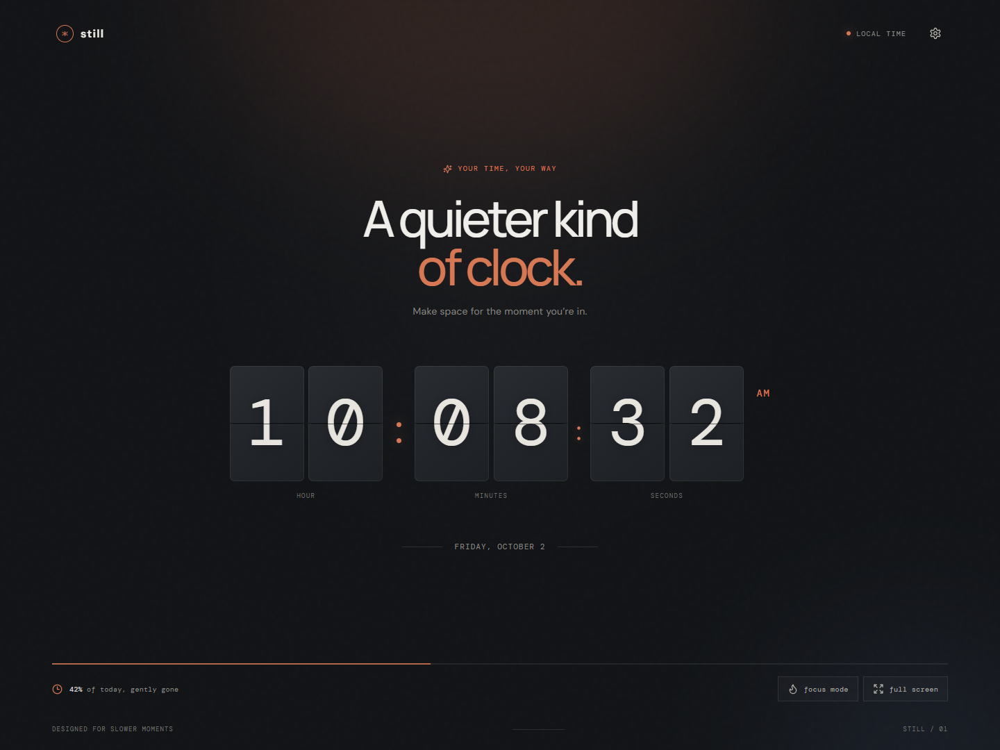
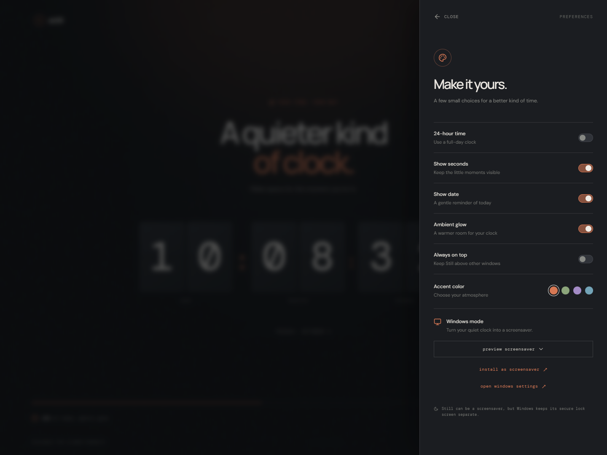
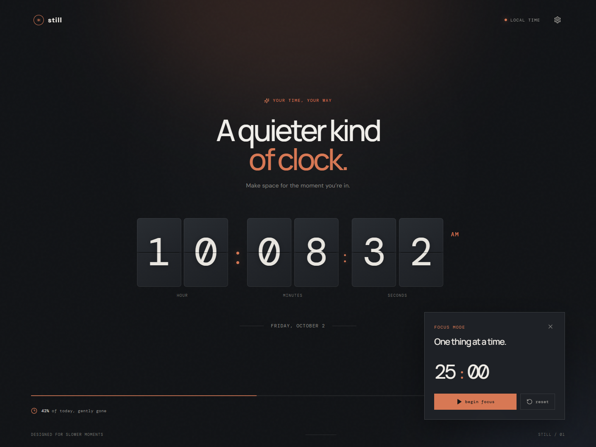
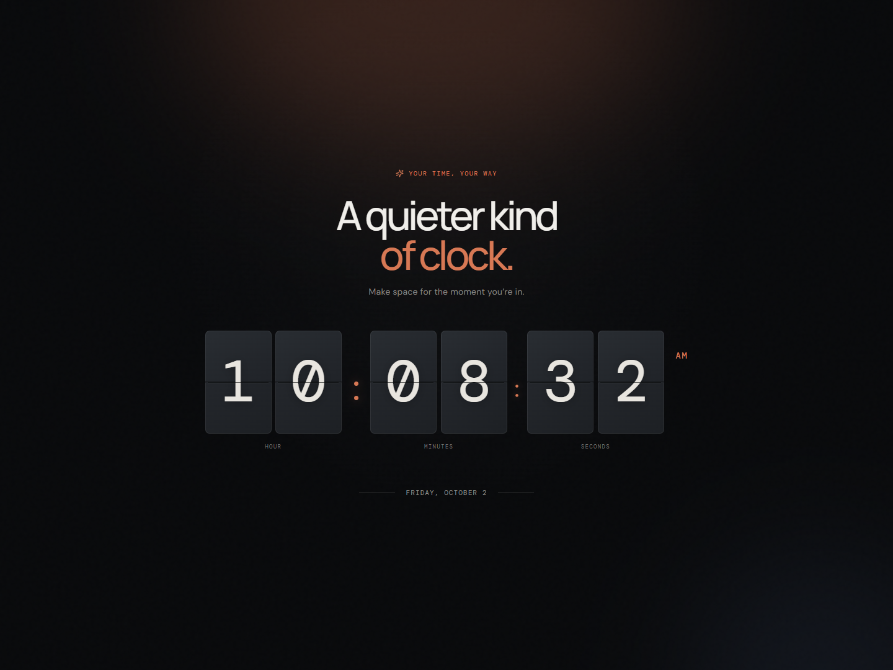

# Still — Flip Clock

A desktop flip clock with a browser preview and a Windows screensaver companion. Built with React, TypeScript, Vite, and Electron; the native screensaver launcher uses C# and .NET Framework.



## 📥 Download

Ready to use Still on your Windows PC? Download the latest installer directly:

👉 **[Download Still Flip Clock Setup (.exe)](https://github.com/sriharshitha-konkathi/flip-clock/releases/download/v1.0.1/Still-1.0.1-setup.exe)**  
📦 **[View All Releases on GitHub](https://github.com/sriharshitha-konkathi/flip-clock/releases)**

> ℹ️ **Windows Installation Note**:  
> As a free open-source software release without a commercial paid certificate, Windows Defender SmartScreen may display a *"Windows protected your PC (Unverified Publisher)"* blue popup.  
> To install: Click **"More info"** and then select **"Run anyway"**.

---

## Features

- Local time with 12/24-hour display, optional seconds, and an optional date.
- Split-panel digit styling and animated digit changes.
- Four accent colors and an ambient glow setting.
- A 25-minute focus timer and full-screen mode.
- Desktop always-on-top control and Windows screensaver preview/registration.
- Preferences saved locally using `localStorage`; no account or backend is required.

Windows' secure lock screen remains separate from the screensaver. See [Windows integration](docs/windows.md) for installation behavior and limitations.

## Screenshots

| Preferences | Focus timer |
| --- | --- |
|  |  |

<details>
<summary>View the screensaver</summary>



</details>

Captured from the Windows app with default preferences and a fixed demo time. Click an image to view it at full size. Images live in the repository, so no external image host is needed. See [screenshot capture instructions](docs/screenshots/README.md) to refresh them after UI changes.

## Requirements

- **Node.js 22.12 or newer**; Node 22.23.3 with npm 10 was used for local checks. `.nvmrc` records that Node version for compatible version managers.
- **npm**, using the committed `package-lock.json`.
- **Windows** for native screensaver compilation and Windows package checks. These workflows have been checked on Windows x64; other desktop platforms are not currently packaged or verified.
- For Windows builds, the installed **.NET Framework C# compiler** (`csc.exe`) and WinForms assemblies. The script searches the Windows `Microsoft.NET/Framework64/v4.0.30319` and `Framework/v4.0.30319` folders. The modern .NET SDK is not required.
- An internet connection for initial dependency/tool downloads. Google Fonts are requested at runtime; system fonts are used if they are unavailable.

Git is only needed when you are ready to version the project. No API keys or `.env` file are required to run it.

## Quick start: browser preview

Run commands from the project root:

```sh
npm ci
npm run dev
```

Open the local address printed by Vite (normally `http://127.0.0.1:5173`). Stop the server with `Ctrl+C`.

The browser preview supports the clock, preferences, and focus timer. Native always-on-top and Windows screensaver actions require Electron.

## Run the desktop app during development

The `npm run desktop` helper currently has a known Windows `spawn EINVAL` issue when starting `.cmd` wrappers. Use two terminals instead:

**Terminal 1 — renderer server:**

```sh
npm run dev -- --port 5173 --strictPort
```

**Terminal 2 — Electron shell:**

```sh
node node_modules/electron/cli.js .
```

Close the Electron window, then stop the server when finished. You can append `--settings` to the Electron command to open preferences. Optional local-server environment settings are documented in [docs/windows.md](docs/windows.md).

## Build

### Web assets

```sh
npm run build
npm run preview
```

Vite writes generated files to `dist/`; `preview` serves them locally (normally on port 4173). The preview server is for local checks, not production hosting. Do not edit files in `dist/` by hand.

### Windows desktop and installer

```sh
# Build an unpacked app for local testing
npm run windows:pack

# Alternatively, build the app and the Windows installer
npm run windows:build
```

Outputs:

| Path | Purpose |
| --- | --- |
| `release/win-unpacked/Still.exe` | Runnable desktop app; keep its adjacent files and folders together |
| `release/Still-<version>-setup.exe` | Installer; currently `Still-1.0.0-setup.exe` |
| `build/Still.scr` | Generated screensaver launcher, also copied next to the packaged executable |

Close an app running from `release/win-unpacked/` before rebuilding. To update an installed copy, run the newly built installer; rebuilding source alone does not update an installed app. Code-signing credentials are not configured in this repository; an unsigned installer may trigger Windows warnings.

## Checks

```sh
npm run typecheck
npm test
npm run build
node scripts/test-built-assets.cjs
```

On Windows, after building a package from the current source:

```sh
npm run windows:pack
node scripts/test-packaged.cjs
```

- `npm test` runs desktop argument checks and Vitest. There are currently **no Vitest test files**; its `--passWithNoTests` flag is intentional and does not imply UI coverage.
- `test-built-assets.cjs` verifies that generated JavaScript/CSS paths work with Electron's `file://` loading.
- `test-packaged.cjs` uses Playwright and the packaged Electron executable to check the clock, individual numerals, responsive layout, settings, and screensaver renderer. It uses a disposable profile and does not register a Windows screensaver. No separate Playwright browser download is needed for this script.
- `npm run test:e2e` is a placeholder for a future Playwright test suite: there is currently no configured suite for that command. Use the packaged smoke script above today.
- No lint command or CI workflow is configured yet.

For optional screenshots and additional manual checks, see [Windows verification](docs/windows.md#checking-the-packaged-ui).

## Project layout

```text
src/                     React UI, clock, preferences, and styles
  App.tsx
  main.tsx
  styles.css
electron/                Main process, preload bridge, and launch arguments
windows/                 Native C# screensaver launcher source
scripts/                 Development, build, and smoke-test helpers
docs/                    Windows integration, Git setup, and app screenshots
index.html               Vite source entry point
vite.config.ts           Vite configuration (relative production asset paths)
electron-builder.yml     Windows packaging configuration
package.json             Dependencies and npm commands
package-lock.json        Reproducible dependency versions (commit this)
```

Generated directories (`node_modules/`, `dist/`, `build/`, `release/`), test output, local agent state, and local design-reference samples under `assets/external-samples/` are intentionally ignored by Git. Application assets outside that reference-only directory remain trackable.

## Troubleshooting

- **Blank packaged window:** keep `base: './'` in `vite.config.ts`. Root-relative `/assets/...` paths point outside the package under `file://`. Rebuild the package and rerun the asset and packaged smoke checks.
- **Two rows of clock digits:** each card must render one `.digit-card__value` across its decorative top/bottom plates. Rebuild or reinstall the latest package if you are still seeing an older version.
- **`spawn EINVAL` from `npm run desktop`:** use the two-terminal development flow above.
- **`csc.exe` not found:** follow the paths reported by `scripts/build-screensaver.cjs` and install or repair the relevant .NET Framework developer tools.
- **Build looks unchanged:** close existing Still instances and open the newly built executable, or reinstall from the new installer.

## Repository preparation and contributions

- [First Git repository setup](docs/repository-setup.md) — review ignored files, make a first commit, and add a remote later.
- [Contributing](CONTRIBUTING.md) — source conventions, checks, and bug reports.

This folder is prepared for Git, but repository initialization, commits, remotes, and publishing are separate steps. `private: true` in `package.json` prevents accidental npm publication; it does **not** make a Git hosting repository private.

## License

This project is licensed under the [MIT License](LICENSE) — free for everyone to use, modify, and distribute.
